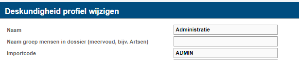

# HelloID-Conn-Prov-Target-NedapOns-Deskundigheid

| :information_source: Information |
|:---------------------------|
| This repository contains the connector and configuration code only. The implementer is responsible to acquire the connection details such as username, password, certificate, etc. You might even need to sign a contract or agreement with the supplier before implementing this connector. Please contact the client's application manager to coordinate the connector requirements.       |

> :warning: **_Information_**    This connector only correlates a HelloID person with an employee account in Nedap Ons and updates the education.
 Extensive knowledge of HelloID provisioning and Nedap Ons is required.

 
 

  

## Table of Contents

- [Introduction](#introduction)
- [Getting Started](#getting-started)
  * [Connection settings](#Connection-settings)
  * [Remarks](#Remarks)
  * [Provisioning](#provisioning)
  * [Employee Additional Mapping](#Employee-Additional-Mapping)
- [Setup the connector](#setup-the-connector)
- [HelloID Docs](#helloid-docs)

## Introduction
NedapOns is a healthcare application and provides a set of REST APIs and XML IO-Import that allow you to programmatically interact with it's data.

## Getting Started

The _HelloID-Conn-Prov-Target-NedapOns-education_ connector can be executed only on-premises using the HelloID-Agent, because of the mapping file and required certificate to authorize with Nedap.

### Connection settings

The following settings are required to connect to the API.

| Setting     | Description |
| ------------ | ----------- |
| Environment URL API     |    https://api-staging.ons.io                                     |
| Certificate (.PFX) Path    |  Fullpath to Certificate> Nedap-cert.pfx                       |
| Certificate Password |    Password of the certificate                                       |
| IO Import Url| The URL of the IO import *https://{CustomerURL}.ioservice.net/importws/import* | 
| IO Import Username | The username of the IO import |
| IO Import Password | The password of the IO import |
| Mapping File |  The Path to the mapping file |
| CSV separation Character| Mapping File CSV Separation Character         |

### Remarks
- This connector only correlates a HelloID person with one or more employee accounts in NedapOns and updates the education (deskundigheid). It updates the education of all the accounts from the contracts in the conditions.
- To empty a education use the text '<geen deskundigheid>' as a placeholder.
- The script used for updating is identical to the script used for creating.

### Provisioning

| Files       | Description                                             |
| ----------- | ------------------------------------------              |
| create.ps1  | Correlates a HelloID person with a NedapOns employee account and updates the registration profile |
| update.ps1  | There is no seperate file for the update script as it is identical to the create script |
----------

###  Employee Additional Mapping
| Header    | Description |
| ------------ | ----------- |
| Title.ExternalId   | Property of the HelloID contracts
| Department.ExternalId  | Property of the HelloID contracts
| educationId | deskundigheden > import code (refer to the image presented below)

  

## Getting help
> _For more information on how to configure a HelloID PowerShell connector, please refer to our [documentation](https://docs.helloid.com/hc/en-us/articles/360012558020-Configure-a-custom-PowerShell-target-system) pages_

> _If you need help, feel free to ask questions on our [forum](https://forum.helloid.com/forum/helloid-connectors/provisioning/1297-helloid-prov-target-nedap-ons-deskundigheid)_

## HelloID Docs

The official HelloID documentation can be found at: https://docs.helloid.com/
